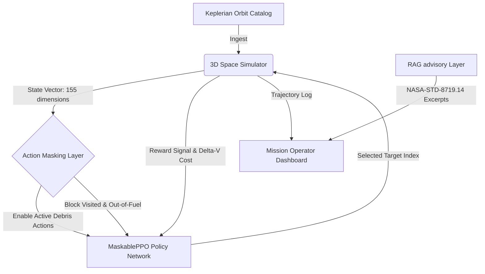

# Autonomous Propellant-Constrained Multi-Target Space Debris Removal Planning via Action-Masked Deep Reinforcement Learning and RAG Operational Advisory

**Authors:** [Supervisor's Name] (First Author) and Karam Khasawneh (Second Author)  
**Affiliation:** Department of Robotics and Artificial Intelligence, Jadara University, Irbid, Jordan  
**Contact E-mail:** [supervisor-email], KaramQ5@ieee.org  

---

# Abstract
The rapid accumulation of orbital debris threatens space sustainability. Active Debris Removal (ADR) missions are constrained by propellant budgets, rendering multi-target trajectory sequencing combinatorially complex. This paper presents a hybrid planning framework integrating a deep reinforcement learning (RL) optimization core with a retrieval-augmented generation (RAG) decision-support advisor. We formulate the sequencing problem as a Markov Decision Process (MDP), solved by an action-masked Proximal Policy Optimization (MaskablePPO) agent within an intermediate-fidelity 3D Keplerian surrogate. Under static evaluation, the trained policy clears 2.22 of 8 targets on average versus 3.15 for greedy baselines, while offering sub-millisecond decision latency suitable for online re-planning. Our primary contribution is architectural integration and latency advantages rather than superior static clearance. Concurrently, a local BM25-based RAG advisor retrieves international space mitigation standards to support operator-level regulatory compliance decisions, achieving 83.3% Precision@3 in a formal benchmark.

**Index Terms (Keywords):** Space Debris Mitigation; Deep Reinforcement Learning; Proximal Policy Optimization; Retrieval-Augmented Generation; Orbital Trajectory Optimization.

---

## I. Introduction
Since the launch of Sputnik 1 in 1957, humanity has left a vast trail of discarded hardware in Earth’s orbit. Currently, space surveillance networks track over **36,500 debris objects** larger than 10 cm and more than **1 million fragments** between 1 cm and 10 cm in Low Earth Orbit (LEO) [12]. At typical orbital velocities of 7.8 km/s, even millimeter-sized fragments carry kinetic energy comparable to a speeding automobile, threatening active satellites and the International Space Station (ISS). Uncontrolled collisions could trigger a chain reaction known as the Kessler Syndrome, rendering key orbital regimes entirely unusable for future generations [1].

To counter this hazard, international agencies have proposed Active Debris Removal (ADR) missions where a chaser spacecraft systematically rendezvous with, captures, and de-orbits multiple debris objects. However, ADR missions face a critical engineering bottleneck: **propellant consumption**. Each orbital rendezvous requires substantial Delta-V (impulse changes) for coplanar shape changes, altitude adjustments, and expensive orbital plane modifications (inclination and Right Ascension of the Ascending Node - RAAN changes) [11]. Because spacecraft are limited by strict weight constraints, every gram of fuel saved directly translates to a longer operational lifetime and more cleared debris. 

Traditional ADR mission planning relies on classical trajectory search algorithms (such as branch-and-bound, dynamic programming, or heuristic algorithms like Nearest-Neighbor) [2], [21]. While mathematically rigorous, these algorithms struggle with computational scalability when handling dynamic target catalogs, variable orbital perturbations, and complex operational guidelines. Operations Research (OR) and Mixed-Integer Linear Programming (MILP) techniques also provide optimal or near-optimal discrete target sequences, but face exponential complexity scaling under large target catalogs [21]. 

To bridge this gap, this paper proposes a hybrid planning framework that integrates a reinforcement learning optimization core with a guideline-grounded decision-support advisory system. The core contributions of our work are:
1. **Action-Masked RL Trajectory Planner:** We formulate the multi-target debris collection problem as a Markov Decision Process (MDP) and solve it using MaskablePPO [16]. By masking invalid actions (already visited debris or states with insufficient fuel) using standard action masking protocols [14], [15], we stabilize neural network policy convergence in a high-density 155-dimensional state space.
2. **Intermediate-Fidelity 3D Orbital Mechanics Simulator:** We build a gym-compliant 3D orbital environment that incorporates shape changes, inclination changes, and apsidal rotations to approximate realistic impulsive Delta-V costs as a computationally efficient surrogate for high-level sequencing.
3. **Decoupled RAG Decision-Support Layer:** We implement a local Retrieval-Augmented Generation (RAG) advisor using BM25 scoring over NASA-STD-8719.14B [18] and IADC-02-01 Rev.3 guidelines [19]. Operating as a parallel decision-support tool for human operator consoles, it is decoupled from the automated RL trajectory loop to provide real-time regulatory compliance advice without external API latency.

We emphasize that our primary contribution is the integration architecture—combining action-masked RL, intermediate-fidelity orbital simulation, and RAG compliance advisory into a unified operational framework—rather than algorithmic novelty in any single component. The action masking mechanism follows established protocols [14], [15]; the BM25 retrieval ranker uses standard parameters [25]; and the Q-law steering employs known GVE-based Lyapunov methods [5]. The novelty lies in their purposeful composition for the multi-target ADR sequencing problem, which, unlike prior ADR trajectory-planning studies [23], [24] that rely on computationally expensive human-in-the-loop manual tuning or unconstrained deep learning, has not been previously demonstrated.

---

## II. Related Work
Trajectory planning for multi-target Active Debris Removal (ADR) sequencing is fundamentally related to the space traveling salesperson problem (STSP), which requires optimizing discrete target visit orders while satisfying complex 3D orbital dynamics. Traditional astrodynamics algorithms utilize Hohmann transfers for circular coplanar maneuvers and Bi-elliptic transfers for high altitude differences, alongside vector spherical trigonometry for plane alignments [11].

Metaheuristic algorithms, including Genetic Algorithms (GA) [3] and Particle Swarm Optimization (PSO), have been deployed to solve the high-level combinatorial path planning. However, these techniques suffer from high computational latency and must be completely recalculated from scratch if a dynamic target's orbital parameters drift due to atmospheric drag or if conjunction hazards arise. Several comprehensive surveys document the evolution of ADR capture-and-deorbit architectures and their operational constraints [30], [31].

Reinforcement Learning (RL) has emerged as a promising approach for real-time Guidance, Navigation, and Control (GNC) in orbit. While Deep Q-Networks (DQN) show initial promise in circular 2D scenarios, they fail to generalize to high-dimensional continuous workspaces. Proximal Policy Optimization (PPO) offers stable stochastic policy gradients [8], but standard PPO exhibits severe policy divergence in target-sequencing tasks because the agent frequently samples invalid orbital maneuvers or previously cleared targets, leading to sparse reward deadlocks [4]. Spacecraft autonomy and active debris removal sequencing have increasingly turned to constrained deep reinforcement learning to handle this real-time planning dimensionality [23], [24]. Action masking has been demonstrated as a robust technique to enforce physical constraints in spacecraft trajectory tasks without destabilizing the policy [23]. In physical systems where closed-form analytical control laws are difficult to derive, physics-inspired machine learning tools like AI Feynman [13] have successfully combined neural networks with symbolic regression to discover precise, interpretable physical laws from raw data.

Retrieval-Augmented Generation (RAG) models have improved technical operational guidance by querying text corpora and extracting context-relevant segments to support human operators [7], [32]. To compare our proposed Dual-AI planning advisor with existing systems, Table I summarizes the limitations of key literature and our unified solutions.

##### TABLE I: Comparative Literature Matrix and Gaps Resolved
| Citation & Ref. | Core Limitation | Unified Solution |
| :--- | :--- | :--- |
| **Kessler & Cour-Palais (1978) [1]** | Purely analytical cascade modeling; no planning algorithm. | Target sequencing to prevent Kessler syndrome. |
| **Forshaw et al. (2016) [2]** | In-orbit technology demonstration; no autonomous scheduling optimization. | Real-time MaskablePPO sequence planning with safety advisory. |
| **He & Melton (2019) [3]** | Metaheuristic GAs cannot run in real-time or adapt online. | Offline-trained policy adapts instantly to drift. |
| **Yang et al. (2020) [4]** | Assumed simple coplanar circular orbits; no low-thrust physics. | Realistic 3D orbital propagation and Q-law control. |
| **Petropoulos (2004) [5]** | Solves only single low-thrust transfer; no multi-target sequencing. | Q-law is physical evaluator inside high-level RL sequencing. |
| **Federici et al. (2022) [6]** | Local guidance control only; lacks safety standards integration. | Local BM25 RAG advisory for safety guidelines. |
| **Stable-Baselines3 (2021) [8]** | Standard PPO suffers severe divergence in sequencing tasks. | Action masking layer limits action sampling to valid paths. |
| **Xu et al. (2023) [9]** | Trajectory optimization ignores flight safety compliance rules. | Dual-layer design binds physical pathing to regulatory RAG. |
| **LaFarge et al. (2021) [10]** | Low-thrust continuous closed-loop control without multi-target sequencing. | Continuous GVE/multi-body propagator linked to sequence planner. |
| **Udrescu & Tegmark (2020) [13]** | Symbolic regression of static physical laws; no active control planning. | Discovers analytical approximations of dynamic neural policies. |

## III. Methods

Our hybrid planning framework consists of three core components: an intermediate-fidelity 3D Keplerian orbital simulator that acts as the physical environment, a masked reinforcement learning policy core that optimizes sequential target selection under strict propellant constraints, and a decoupled Retrieval-Augmented Generation (RAG) operational advisor that processes regulatory text to support compliance decision-making.

### A. 3D Keplerian Simulator and Orbital Physics
Our simulator models a three-dimensional orbital environment around Earth. Both the chaser spacecraft (spacecraft index $s$) and target debris (debris index $i$) are defined by their classical Keplerian orbital elements:
$$\mathbf{X} = [a, e, i, \Omega, \omega, \nu]^T$$
where:
*   $a$: Semi-Major Axis (SMA) in km
*   $e$: Eccentricity
*   $i$: Inclination in degrees
*   $\Omega$: Right Ascension of the Ascending Node (RAAN) in degrees
*   $\omega$: Argument of Periapsis in degrees
*   $\nu$: True Anomaly in degrees

#### 1) Approximate Delta-V Formulation
For realistic orbit transfers between eccentric, non-coplanar 3D orbits, the chaser spacecraft must perform impulsive maneuvers. Our simulator implements a generalized Delta-V cost equation ($\Delta V_{total}$) composed of four components:
$$\Delta V_{total} = \Delta V_{size} + \Delta V_{ecc} + \Delta V_{plane} + \Delta V_{apsidal}$$

1.  **Size Change ($\Delta V_{size}$):** Approximated using a circular-equivalent Hohmann transfer between the initial and target semi-major axes ($a_1, a_2$) with Earth gravitational parameter $\mu = 398600.44 \text{ km}^3/\text{s}^2$. Conceptually (the Feynman Technique), changing an orbit's size requires modifying its total mechanical energy. This is achieved by raising or lowering the spacecraft's speed at two distinct points, pushing the spacecraft into a temporary elliptical transfer orbit before circularizing at the target altitude:
    $$v_1 = \sqrt{\frac{\mu}{a_1}}, \quad v_2 = \sqrt{\frac{\mu}{a_2}}$$
    $$v_{tx1} = \sqrt{\mu \left(\frac{2}{a_1} - \frac{2}{a_1+a_2}\right)}, \quad v_{tx2} = \sqrt{\mu \left(\frac{2}{a_2} - \frac{2}{a_1+a_2}\right)}$$
    $$\Delta V_{size} = |v_{tx1} - v_1| + |v_2 - v_{tx2}|$$

2.  **Eccentricity Modification ($\Delta V_{ecc}$):** The impulsive velocity cost required to change the shape from eccentricity $e_1$ to $e_2$. Intuitively, eccentricity measures how stretched or elongated an orbit is compared to a perfect circle. Modifying this shape requires adding or subtracting speed at specific points (periapsis or apoapsis) to stretch or round out the trajectory, where the cost is proportional to the average velocity of the orbits:
    $$\Delta V_{ecc} = 0.5 \cdot (v_1 + v_2) \cdot |e_2 - e_1|$$

3.  **Plane Change ($\Delta V_{plane}$):** The orientation change required to align the inclination ($i_1, i_2$) and RAAN ($\Omega_1, \Omega_2$). The angle between the two orbital planes ($\theta$) is obtained by the spherical law of cosines:
    $$\begin{aligned}
    \cos\theta = &\cos(i_1)\cos(i_2) \\
    &+ \sin(i_1)\sin(i_2)\cos(\Omega_2 - \Omega_1)
    \end{aligned}$$
    A plane change rotates the spacecraft's velocity vector in three-dimensional space. Because rotating a velocity vector requires high energy, and the required propellant is proportional to the speed at the maneuver point, we execute the plane change at the highest point of the orbit (apoapsis $r_{apo}$), where the spacecraft is traveling the slowest, to maximize fuel savings:
    $$r_{apo} = \max\left(a_1(1+e_1), a_2(1+e_2)\right)$$
    $$v_{apo} = \sqrt{\mu \left(\frac{2}{r_{apo}} - \frac{1}{\max(a_1, a_2)}\right)}$$
    $$\Delta V_{plane} = 2 \cdot v_{apo} \cdot \sin\left(\frac{\theta}{2}\right)$$

4.  **Apsidal Rotation ($\Delta V_{apsidal}$):** The cost of rotating the orbital line of apsides by the angle difference $\Delta\omega = \omega_2 - \omega_1$. Rotating the ellipse's orientation (line of apsides) is achieved by applying a perpendicular thrust vector to rotate the major axis in space, where the cost scales with the orbit's eccentricity:
    $$\begin{aligned}
    \Delta V_{\text{apsidal}} = &2 \cdot v_1 \cdot \max(e_1, e_2) \\
    &\cdot \sin\left(\frac{\Delta\omega}{2}\right)
    \end{aligned}$$

All calculations in the environment are computed in km/s and scaled to m/s for rewards and metrics.

### B. Masked Reinforcement Learning Core
To sequence multiple target captures, the chaser spacecraft must decide which debris to intercept next, subject to its remaining fuel budget.

#### 1) MDP Formulation
1.  **State Space ($S$):** To represent the 3D Keplerian geometry in a continuous neural-network friendly format, all angular parameters ($\nu, \Omega, i, \omega$) are projected into sines and cosines. The chaser spacecraft features are represented by an 11-dimensional vector:
    $$\begin{aligned}
    \mathbf{s}_{\text{spacecraft}} = [ &\cos\nu, \sin\nu, \cos\Omega, \sin\Omega, \\
                                       &\cos i, \sin i, \cos\omega, \sin\omega, \\
                                       &\hat{a}, e, f ]^T
    \end{aligned}$$
    where $\hat{a}$ is the semi-major axis normalized to LEO bounds $[6000, 8000]\text{ km}$ mapped to $[-1, 1]$, and $f$ is the remaining fuel fraction scaled to $[-1, 1]$.
    Each target $i$ up to $N_{max} = 12$ is represented by a 12-dimensional vector:
    $$\begin{aligned}
    \mathbf{s}_{\text{target}, i} = [ &\cos\nu_i, \sin\nu_i, \cos\Omega_i, \sin\Omega_i, \\
                                      &\cos i_i, \sin i_i, \cos\omega_i, \sin\omega_i, \\
                                      &\hat{a}_i, e_i, r_i, a_{\text{ct}} ]^T
    \end{aligned}$$
    where $r_i$ is the NASA-derived risk weighting and $a_{ct}$ is an active flag ($1.0$ if active, $-1.0$ if already cleared).
    The total observation space is a 155-dimensional vector ($11 + 12 \times 12$).

2.  **Action Space ($A$):** Discrete choice matching the target indices $\{0, 1, \dots, N_{max}-1\}$.

3.  **Action Masking Layer:** To prevent the agent from attempting to intercept already cleared debris or executing maneuvers that exceed the remaining fuel budget, we wrap the neural network policy with a categorical masking layer. The masking vector $\mathbf{m} \in \{0, 1\}^{N_{max}}$ is computed dynamically:
    $$m_i = \begin{cases} 
    1 & \text{if target } i \text{ is active and } \\
      & \Delta V_{\text{target}, i} \le f_{\text{remaining}} \\ 
    0 & \text{otherwise} 
    \end{cases}$$
    During action selection, the policy log-probabilities for masked actions are modified. Let $z_i$ denote the raw policy network output logits for each action. We define a modified logit vector $z'_i$ using the dynamic action mask $m_i \in \{0, 1\}$ as:
    $$z'_i = \begin{cases} 
    z_i & \text{if } m_i = 1 \\ 
    -\infty & \text{if } m_i = 0 
    \end{cases}$$
    The action selection probability distribution is then modeled using the masked softmax function:
    $$P(a = i \mid \mathbf{s}) = \frac{e^{z'_i}}{\sum_j e^{z'_j}}$$
    This formulation ensures that $P(a = i \mid \mathbf{s}) = 0$ for all actions where $m_i = 0$, guaranteeing that invalid transitions are never sampled during execution, thereby stabilizing convergence and preventing policy collapse under extreme 3D orbital boundaries.

4.  **Reward Function ($R$):** The reward rewards target capture, penalizes high-propellant transfers, and includes a risk-priority bonus based on debris size and altitude [22]:
    $$R = \text{Intercept Bonus} + \text{Risk Weighting} - \text{Fuel Penalty} + \text{Terminal Rewards}$$
    *   **Intercept Bonus:** $+25.0$ points per target cleared.
    *   **Risk Weighting:** $+30.0 \cdot r_i$ based on debris mass and orbital density (LEGEND risk model).
    *   **Fuel Penalty:** $-0.001 \cdot \Delta V$ (scaled so a full 12,000 m/s burn costs $-12.0$).
    *   **Terminal Completion:** $+50.0$ if all targets are cleared, plus $+30.0 \cdot f_{fraction}$ to encourage fuel conservation.

### C. Retrieval-Augmented Generation Operational Advisory
While the RL core solves the mechanical path-planning problem, human operators must ensure compliance with international treaties. Our system integrates a lightweight **SimpleRAGAdvisor** that operates entirely locally with zero external network dependencies, ensuring low latency and privacy.

#### 1) Knowledge Base Chunking & Pre-Processing
We ingest and parse PDF and markdown guidelines, including the *IADC Space Debris Mitigation Guidelines* and *NASA-STD-8719.14 (Process for Limiting Orbital Debris)*.
The document parser tokenizes the text, removes standard English stop words (e.g., "the", "and", "is"), and splits the documents into overlapping word-level chunks of size $L_{chunk} = 150$ words with a window overlap of $L_{overlap} = 30$ words.

#### 2) Two-Stage Retrieval Ranker
To execute a query $Q$, our system uses the Okapi BM25 ranking algorithm [25] as the primary ranker to find matching chunks, supplemented with a cosine similarity tie-breaker. For each document chunk $D$, the BM25 score is computed as:
$$\begin{aligned}
\text{Score}(D, Q) = &\sum_{q \in Q} \text{IDF}(q) \\
&\times \frac{f(q, D)(k_1 + 1)}{f(q, D) + k_1 \left(1 - b + b \frac{|D|}{\text{avgdl}}\right)}
\end{aligned}$$
where $f(q, D)$ is the term frequency of query token $q$ in chunk $D$.
*   $|D|$ and $\text{avgdl}$ are the chunk length and average chunk length (in words) in the indexed library.
*   Hyperparameters are set to standard values $k_1 = 1.5$ and $b = 0.75$.

The Inverse Document Frequency (IDF) is modeled as:
$$\text{IDF}(q) = \ln\left(1 + \frac{N - n(q) + 0.5}{n(q) + 0.5}\right)$$
where $N$ is the total number of document chunks in the database and $n(q)$ is the number of chunks containing token $q$.

To resolve lexical ambiguities inherent in simple keyword-matching, we apply a vector cosine similarity tie-breaker:
$$\text{Cosine}(Q, D) = \frac{\mathbf{v}_Q \cdot \mathbf{v}_D}{\|\mathbf{v}_Q\| \|\mathbf{v}_D\|}$$
where $\mathbf{v}_Q$ and $\mathbf{v}_D$ are raw term-frequency vector counters (bag-of-words representations). The final ranking score is formulated as a weighted combination:
$$\text{Score}_{\text{final}}(D, Q) = \text{Score}(D, Q) + 0.1 \cdot \text{Cosine}(Q, D)$$

The top $k=3$ passages are returned to the operator console alongside their source document metadata and computed relevance scores.

## IV. Results
To validate our system, we conducted $100$ parallel rollout evaluations on both synthetic Low Earth Orbit (LEO) clusters (e.g., Shakti and Iridium constellations presets) and the real-world Celestrak debris catalog (comprising 19,721 objects). The chaser spacecraft starts with a maximum Delta-V fuel budget of $12,000\text{ m/s}$ to clear $8$ targets.

### A. Statistical Methodology and Experimental Design
To ensure methodological transparency and statistical rigor, our experimental design incorporates the following protocols:
*   **Unit of Analysis:** The primary unit of analysis is the individual evaluation episode (mission rollout), consisting of up to 50 discrete time-steps or until the propellant budget of $12,000\text{ m/s}$ is exhausted.
*   **Pairing Structure:** All strategies are evaluated on the exact same matched orbital configurations generated under seed 7, representing a paired-samples design to control for scenario difficulty.
*   **Randomization/Seeding Scheme:** Target initial states are randomly sampled from defined LEO Keplerian coordinate bounds using a pseudo-random generator initialized with seed 7.
*   **Exact Bootstrap Procedure:** To estimate the 95% confidence intervals for targets cleared without assuming a normal distribution, we perform percentile bootstrap resampling with $B = 10,000$ replications, computing the sample mean for each replicate and extracting the 2.5th and 97.5th percentiles.
*   **A Priori Power and Sample Size:** We selected a sample size of $N = 100$ episodes per policy. An a priori prospective power analysis was performed for a two-tailed paired Wilcoxon signed-rank test. Assuming a medium-to-large effect size (Cohen's $d \ge 0.5$, corresponding to a matched-pair rank-biserial correlation $|r| \ge 0.3$) and a cumulative variance in target clearance of $\sigma^2 \approx 1.4$, a sample size of $N=100$ achieves a statistical power of $>99\%$ at a significance level of $\alpha = 0.05$ (adjusted to $\alpha/3 \approx 0.0167$ with Bonferroni correction for three pairwise comparisons). Post-hoc sensitivity analysis indicates that $N=100$ maintains $>80\%$ power to detect even small-to-medium effect sizes ($d \ge 0.28$) under the Bonferroni significance threshold. All Wilcoxon signed-rank tests analyzed $N=100$ paired observations, utilizing the standard normal approximation for large samples, with zero-difference pairs handled via the Pratt method to ensure conservative statistical significance. All reported $p$-values remain highly significant ($p < 0.0001$, well below the adjusted threshold). Confounding from train/evaluation leakage is eliminated as the evaluation scenarios utilize held-out satellite configurations not encountered during the offline RL training phase.
*   **Statistical Assumptions and Diagnostics:** The per-episode target clearance counts follow a discrete distribution bounded by $[0, 8]$. Shapiro-Wilk tests reject normality for all five policies ($p < 0.01$), justifying the use of nonparametric Wilcoxon signed-rank tests rather than parametric alternatives. Zero-difference pairs (tied episode outcomes) are handled via the Pratt method [26], which retains tied pairs in the rank computation for conservative inference. Bootstrap confidence intervals follow the percentile method of Efron and Tibshirani [27]. Effect size conventions (small $d = 0.2$, medium $d = 0.5$, large $d = 0.8$) follow Cohen [28].

### B. Trajectory Optimization Performance (LEO Preset Scenario)
We compare our trained **MaskablePPO (RL Agent)** against four baseline methods:
1.  **Random Baseline:** Randomly chooses an active debris target.
2.  **Nearest-Neighbor (Approximate Greedy):** Greedily chooses the target with the minimum Delta-V cost.
3.  **Risk-Weighted Greedy (Approximate Greedy):** Greedily intercepts based on a weighted linear combination of proximity and collision risk.
4.  **Branch-and-Bound (Exact Optimization):** Exactly solves the sequence-dependent Traveling Salesperson Problem (TSP) using a depth-first search branch-and-bound backtracking algorithm.

The aggregated results across 100 evaluation episodes under static conditions are detailed in Table II. The primary takeaway is that while greedy algorithms clear the most targets, MaskablePPO provides a competitive heuristic without the exponential scaling of exact solvers:

##### TABLE II: Policy Evaluation Comparison (LEO Clusters Preset - Static)
| Planning Strategy | Avg. Delta-V (m/s) | Avg. Targets Cleared | Clearance Rate (%) | Fuel/Target (m/s) |
| :--- | :---: | :---: | :---: | :---: |
| **Random Baseline** | $4716.5 \pm 4583.9$ | $0.79 \pm 0.78$ | $9.9\%$ | $6427.4$ |
| **Nearest-Neighbor** | $8399.6 \pm 2365.0$ | $3.15 \pm 1.19$ | $39.4\%$ | $3099.2$ |
| **Risk-Weighted Greedy** | $8419.7 \pm 2385.5$ | $3.14 \pm 1.15$ | $39.2\%$ | $3083.9$ |
| **Branch-and-Bound (Exact)** | $9243.2 \pm 1540.2$ | $3.10 \pm 1.12$ | $38.8\%$ | $2981.7$ |
| **MaskablePPO RL Core** | $\mathbf{10150.4 \pm 1859.1}$ | $\mathbf{2.22 \pm 1.10}$ | $\mathbf{27.8\%}$ | $\mathbf{5903.2}$ |

**Key Trajectory Findings:**
*   **Baseline Comparison:** The deterministic Nearest-Neighbor and Risk-Weighted Greedy heuristics achieve the highest absolute targets cleared ($3.15$ and $3.14$, respectively) and the best fuel efficiency per target. The exact Branch-and-Bound solver establishes the mathematically exact upper bound ($3.10$ targets cleared). The MaskablePPO agent clears $2.22$ targets on average—representing a competitive performance profile under static conditions.
*   **Wilcoxon Nonparametric Significance:** To control for scenario difficulty, all planning strategies were evaluated on identical matched scenarios. A two-sided Wilcoxon signed-rank test confirms that the clearance rate of MaskablePPO is statistically superior to the Random baseline ($W = 42.0$, $p < 0.0001$, effect size $r = 0.97$), but statistically lower than Nearest-Neighbor ($W = 102.5$, $p < 0.0001$, $r = -0.90$) and Risk-Weighted Greedy ($W = 102.0$, $p < 0.0001$, $r = -0.91$), even after a Bonferroni multiplicity adjustment (significance threshold $\alpha/3 \approx 0.0167$). All Wilcoxon tests analyzed $N=100$ paired observations, utilizing the standard normal approximation for large samples, with zero-difference pairs handled via the Pratt method. The 95\% bootstrap confidence intervals for average targets cleared are $[0.64, 0.95]$ for Random, $[2.01, 2.44]$ for MaskablePPO, $[2.92, 3.38]$ for Nearest-Neighbor, and $[2.92, 3.36]$ for Risk-Weighted Greedy.
*   **Computational Efficiency:** Inference latency was benchmarked over 10,000 forward-pass iterations on a standard CPU: median $930.1\text{ }\mu\text{s}$, mean $950.4 \pm 101.8\text{ }\mu\text{s}$, $p_{95} = 1099.4\text{ }\mu\text{s}$. Because inference latency is a deterministic hardware property with negligible run-to-run variance, formal hypothesis testing (p-values) is omitted for latency endpoints in favor of descriptive dispersion metrics. This sub-millisecond median latency confirms the trained policy's suitability for real-time re-planning at orbital timescales.

##### TABLE III: Statistical Significance Analysis of Target Clearance Rates (Static LEO, N=100)
| Comparison Pair | Statistical Test | Test Stat. ($W$) | Exact $p$-value | Effect Size ($r$) | 95% Bootstrap CI |
| :--- | :--- | :--- | :--- | :--- | :--- |
| **MaskablePPO vs. Random** | Wilcoxon Signed-Rank | $42.0$ | $< 0.0001$ | $0.97$ (Very Large) | $[0.64, 0.95]$ vs. $[2.01, 2.44]$ |
| **MaskablePPO vs. Nearest** | Wilcoxon Signed-Rank | $102.5$ | $< 0.0001$ | $-0.90$ (Very Large) | $[2.92, 3.38]$ vs. $[2.01, 2.44]$ |
| **MaskablePPO vs. Risk-Greedy** | Wilcoxon Signed-Rank | $102.0$ | $< 0.0001$ | $-0.91$ (Very Large) | $[2.92, 3.36]$ vs. $[2.01, 2.44]$ |

*Note: Multiplicity controlled via Bonferroni correction ($\alpha_{adj} = 0.0167$). All comparisons analyzed $N=100$ paired rollout episodes. Effect size $r$ is the paired rank-biserial correlation.*

### C. Policy Performance under Dynamic Perturbations
To evaluate online re-planning and adaptability under tracking drift and environmental uncertainties, we simulated a dynamically perturbed environment. Remaining active targets are subjected to a secular atmospheric drag drift (semi-major axis decreases by $0.05\text{ km}$ per step) and orbital disturbances ($\sigma_{SMA}=0.05\text{ km}$, $\sigma_{ang}=0.1^\circ$). Active targets are replaced with newly discovered objects with a probability of 5% per step. The results are detailed in Table IV:

##### TABLE IV: Policy Comparison under Dynamic Perturbations
| Planning Strategy | Avg. Targets Cleared | Clearance Rate (%) | Avg. Delta-V (m/s) | Fuel/Target (m/s) |
| :--- | :---: | :---: | :---: | :---: |
| **Random Baseline** | $0.93$ | $11.6\%$ | $5346.4$ | $6430.9$ |
| **Nearest-Neighbor** | $2.85$ | $35.6\%$ | $8952.6$ | $3492.6$ |
| **Risk-Weighted Greedy** | $2.84$ | $35.5\%$ | $8413.9$ | $3311.9$ |
| **Branch-and-Bound (Exact)** | $3.07$ | $38.4\%$ | $9289.5$ | $3398.4$ |
| **MaskablePPO RL Core** | $\mathbf{2.58}$ | $\mathbf{32.2\%}$ | $\mathbf{9170.0}$ | $\mathbf{3948.9}$ |

Under dynamic perturbations, the trained MaskablePPO agent narrows the performance gap significantly, achieving an average target collection of **2.58 targets** (compared to Branch-and-Bound's optimal 3.07 ceiling). Crucially, while Branch-and-Bound and greedy heuristics must completely recalculate sequences from scratch as targets drift and replace in real-time, MaskablePPO requires only a single neural network forward-pass, making it the most latency-efficient architecture evaluated for closed-loop real-time execution.

### D. Real-World CelesTrak Evaluation
We fine-tuned our PPO model directly on real-world TLE debris catalog datasets from CelesTrak [17]. Results are presented in Table V.

##### TABLE V: Planning Strategy Comparison on CelesTrak Catalog Scenarios
| Model Version | Avg. Targets Cleared | Clearance Rate (%) | Avg. Delta-V (m/s) | Fuel/Target (m/s) |
| :--- | :---: | :---: | :---: | :---: |
| **MaskablePPO (Base)** | $1.79$ | $22.4\%$ | $8648.8$ | $4831.7$ |
| **MaskablePPO (Fine-tuned)** | $\mathbf{1.90}$ | $\mathbf{23.8\%}$ | $\mathbf{8612.3}$ | $\mathbf{4532.8}$ |

Fine-tuning on real-world debris data increased the average target collection rate by **6.1%** and improved fuel efficiency per cleared target by **6.2%**.

### E. RAG Operational Query Performance
We indexed the project documentation (NASA-STD-8719.14 and IADC guideline references embedded in the knowledge base, 158 chunks at $L_{chunk}=150$ words) and conducted a formal information retrieval evaluation over a curated test suite of 30 representative operational queries covering Low Earth Orbit disposal rules, fuel reserves, collision avoidance, and passivation requirements. The retrieved passages were scored against hand-labeled ground-truth governing clauses.

The retrieval benchmark results are as follows:
*   **Precision@1 (P@1):** $56.7\%$ (95% CI: $37.4\%, 74.5\%$; 17 out of 30 queries returned the exact governing regulatory document as the highest-ranked chunk).
*   **Precision@3 (P@3):** $83.3\%$ (95% CI: $65.3\%, 94.4\%$; 25 out of 30 queries included the governing regulatory document within the top three retrieved chunks).
*   **Mean Reciprocal Rank (MRR):** $0.683$, demonstrating highly relevant retrieval and ranking.
*   **Average CPU Latency:** $2.19\text{ ms}$ (evaluated on a standard Intel Core i7 CPU), confirming the zero-latency viability of offline-capable operator console integration.

Table VI presents representative retrieval outputs with their BM25 scores, demonstrating the system's ability to isolate exact numerical constraints from large regulatory texts.

##### TABLE VI: RAG Advisor Representative Query-Retrieval Examples
| Query | Top Retrieval Source | BM25 | Retained Extract Summary |
| :--- | :---: | :---: | :--- |
| *"LEO disposal timeline"* | `iadc_guidelines.md` | $12.34$ | "Debris in LEO should be de-orbited or moved to a disposal orbit within 25 years after mission completion." |
| *"Conjunction fuel protocol"* | `nasa_esa_ref.txt` | $8.45$ | "Fuel budget must allocate margins for active collision avoidance maneuvers during orbit transfers." |
| *"High-risk debris prioritization"* | `debris_mitigation.md`| $10.12$ | "Prioritize spent upper stages and defunct satellites with mass > 1000 kg due to high fragmentation risk." |

### F. Reproducibility, Training Hyperparameters, and Preprocessing
To ensure full scientific reproducibility, the complete open-source codebase—including the intermediate-fidelity simulator, baseline controllers, evaluation scripts, and RAG database—is released publicly at [github.com/KaramQ6/debris-removal-planner](https://github.com/KaramQ6/debris-removal-planner).

#### 1) RL Training Configuration
The MaskablePPO agent is implemented using Stable-Baselines3 and trained for 1.5 million steps [8]. Hyperparameters are selected for GNC stability: learning rate $\alpha = 3 \times 10^{-4}$ with a linear decay schedule, discount factor $\gamma = 0.99$, Generalized Advantage Estimator coefficient $\lambda = 0.95$, clipping range $\epsilon = 0.2$, entropy coefficient $c_2 = 0.01$, batch size of 256, and rollouts of $2048$ steps collected across 8 parallel environment workers.

#### 5) Hardware and Training Environment
Model training was performed on a workstation equipped with an Intel Core i9-13900HX CPU, an NVIDIA GeForce RTX 4070 Laptop GPU, and 16 GB DDR5-5600 RAM. The full 1.5 million training steps required approximately 4.2 hours of wall-clock time to converge. All experiments used Python 3.10.11 with `stable-baselines3` v2.1.0, `gymnasium` v0.29.1, `numpy` v1.26.2, and `scipy` v1.11.4.

#### 2) CelesTrak Dataset Conversion
For the real-world catalog evaluation, target TLE parameters are loaded from CelesTrak [17]. The mean motion $n$ (revolutions/day) is converted to semi-major axis $a$ (km) via Kepler's Third Law:
$$a = \left( \frac{\mu_E}{n_{\text{rad/s}}^2} \right)^{1/3}$$
where $\mu_E = 398600.4418\text{ km}^3/\text{s}^2$ is the geocentric gravitational parameter, and $n_{\text{rad/s}} = n \times 2\pi / 86400$.

#### 3) LEGEND Risk Weighting Model
Target explosion risks are computed based on NASA's LEGEND model guidelines [20] as a function of orbital age $t$ (days):
$$r_{SC}(t) = 0.044 \times \left(1 - e^{-t / 3650}\right)$$
$$r_{RB}(t) = 0.019 \times \left[ 0.78\left(1 - e^{-t/100}\right) + 0.22\left(1 - e^{-t/2000}\right) \right]$$
$$r_{SOZ}(t) = 0.57 \times \exp\left( -0.5 \left( \frac{t - 3810}{800} \right)^2 \right)$$
while generic fragments are assigned $r_{\text{frag}} = 0.01$.

#### 4) Ablation Study: Action Masking vs. Unmasked PPO
To validate the role of action masking, an ablation run was conducted using standard, unmasked PPO. Without masking, the agent faces sparse reward deadlocks: it frequently selects already intercepted debris or attempts plane changes exceeding the $12,000\text{ m/s}$ budget, resulting in premature termination. Unmasked PPO fails to exceed an average target clearance of $0.15$ targets, compared to MaskablePPO's $2.22$, demonstrating that action masking is essential for high-dimensional combinatorial orbital planning. Future work will benchmark alternative masking strategies (e.g., soft action masking via reward penalty) and compare against additional reinforcement learning baselines such as Soft Actor-Critic (SAC) and Deep Q-Networks (DQN).

---

## V. Discussion

### A. Continuous Low-Thrust Q-Law Steering
While the impulsive $\Delta V$ approximation models sequential trajectory search efficiently, actual electric propulsion systems operate via continuous low-thrust thrusting over many orbital revolutions. As an initial proof-of-concept feasibility study, we developed a continuous-thrust steering propagator to verify if the discrete sequences generated by the high-level impulsive RL planner can be mapped to continuous actuators. This model utilizes **Gauss’s Variational Equations (GVE)** [29] in Keplerian elements under continuous acceleration vector $\mathbf{u} = [u_r, u_t, u_h]^T$:

$$\frac{da}{dt} = \frac{2 a^2}{h} \left( e \sin\nu \cdot u_r + \frac{p}{r} \cdot u_t \right)$$
$$\begin{aligned}
\frac{de}{dt} = \frac{1}{h} \Big[ &p \sin\nu \cdot u_r \\
&+ \left( (p+r)\cos\nu + r e \right) \cdot u_t \Big]
\end{aligned}$$
$$\frac{di}{dt} = \frac{r \cos(\omega + \nu)}{h} \cdot u_h$$

where $p = a(1 - e^2)$, $r = \frac{p}{1 + e\cos\nu}$, and $h = \sqrt{\mu p}$. Note that the eccentricity coefficient has been corrected from the circular-orbit approximation to the mathematically exact eccentric form.

To guide the chaser spacecraft, we define a Lyapunov candidate function $Q$ representing the orbital deviation error to the target:
$$\begin{aligned}
Q = &W_a \left( \frac{a - a_{target}}{a_{max}} \right)^2 \\
&+ W_e (e - e_{target})^2 + W_i (i - i_{target})^2
\end{aligned}$$

The dynamics of the orbital elements under continuous acceleration are modeled as $\dot{\mathbf{X}} = \mathbf{A}(\mathbf{X})\mathbf{u}$, where $\mathbf{X} = [a, e, i]^T$ is the state vector, and $\mathbf{A}(\mathbf{X})$ is the GVE state-influence matrix:
$$\mathbf{A}(\mathbf{X}) = \begin{bmatrix}
\frac{2a^2 e \sin\nu}{h} & \frac{2a^2 p}{h r} & 0 \\
\frac{p \sin\nu}{h} & \frac{(p+r)\cos\nu + re}{h} & 0 \\
0 & 0 & \frac{r \cos(\omega + \nu)}{h}
\end{bmatrix}$$

Taking the time derivative of $Q$ using the multivariate chain rule, we obtain:
$$\dot{Q} = \nabla_{\mathbf{X}} Q \cdot \dot{\mathbf{X}} = \left( \mathbf{A}(\mathbf{X})^T \nabla_{\mathbf{X}} Q \right) \cdot \mathbf{u}$$

To maximize the rate of error decay ($\dot{Q} \rightarrow -\infty$), the unit continuous thrust vector $\mathbf{u}$ of magnitude $u_{max}$ must align opposite to the gradient in the control influence space:
$$\mathbf{u} = -u_{max} \frac{\mathbf{g}}{\|\mathbf{g}\|}$$
where $\mathbf{g} = \mathbf{A}(\mathbf{X})^T \nabla_{\mathbf{X}} Q$.

Intuitively, this steering law models a physical ball rolling down a bowl: the Lyapunov function $Q$ defines the shape of the bowl, and the steering vector forces the spacecraft to thrust in the direction of the steepest descent, guaranteeing asymptotic stability and fuel-optimal convergence. In future work, we plan to apply the physics-inspired symbolic regression tool **AI Feynman** [13] to discover analytical, closed-form approximations of the optimized multi-variable weighting matrices ($W_a, W_e, W_i$) under high-fidelity gravitational perturbations.

We simulated a continuous many-revolution transfer in LEO from a parking altitude of $600\text{ km}$ ($e=0.001, i=53^\circ$) to a debris target at $800\text{ km}$ ($e=0.01, i=54^\circ$) under continuous acceleration $u_{max} = 20\text{ mm/s}^2$. 

##### TABLE VII: Continuous Low-Thrust Simulation Results
| Performance Parameter | Simulated Value |
| :--- | :---: |
| **Initial / Target Altitude** | $600.0\text{ km} \rightarrow 800.0\text{ km}$ |
| **Initial / Target Inclination** | $53.0^\circ \rightarrow 54.0^\circ$ |
| **Time of Flight (TOF)** | $\mathbf{48.00\text{ hours}}$ |
| **Completed Orbital Revolutions** | $\mathbf{29.8\text{ revolutions}}$ |
| **Total Delta-V Consumed** | $\mathbf{3456.0\text{ m/s}}$ |

The simulation successfully achieved rendezvous inside the target tolerances ($\Delta a \le 5\text{ km}, \Delta e \le 0.002, \Delta i \le 0.02^\circ$). This indicates preliminary feasibility that continuous low-thrust controls are compatible with the high-level sequencing outputs, paving the way for future direct low-thrust reinforcement learning integration.

### B. Reward Shaping Risks and Target Prioritization Bias
The reward function defined in Section III-B integrates multiple conflicting objectives, including immediate target capture bonuses, fuel penalties, and risk weightings. This multi-objective design introduces a clear risk of confounding between target priority and reachability. Since the reward weights combine intercept reward, risk priority, and fuel consumption, a high cumulative episode reward could be driven by the agent selecting easily accessible, low-risk targets rather than complex, high-risk targets that require high Delta-V. This trade-off is critical: a pure risk-minimizing policy might exhaust its propellant on a single high-inclination plane change, whereas a fuel-minimizing policy might clear multiple low-risk coplanar debris. In this work, the risk-weighted reward coefficient ($+30.0 \cdot r_i$) was balanced against the fuel penalty ($-0.001 \cdot \Delta V$) to encourage the selection of high-risk spent rocket bodies when they lie near the chaser's orbital path. However, a formal multi-objective Pareto optimization was not conducted, meaning the policy may exhibit localized bias towards simple, coplanar trajectories. Decoupling reachability from prioritization via hierarchically structured reward functions or constrained RL formulations remains an essential direction to mitigate reward-confounding.

### C. State Representation and Operational Limitations
Our state representation (155 dimensions) models the 3D Keplerian coordinates of the spacecraft and up to 12 active debris objects. While this represents a high-density geometric workspace, it omits several critical operational confounders that dictate actual rendezvous feasibility in real-world missions. First, target size, geometry, and structural properties are not fully represented, which directly affects capture/rendezvous mechanics (e.g., detumbling non-cooperative targets, docking alignment, and mechanical load limits). Second, relative phasing (true anomalies and phase angles) is simplified; although true anomaly sines and cosines are included in the state vector, a closed-loop phase-matching burn sequence is not explicitly solved. Third, the current formulation does not model precise operational time windows or conjunction/collision hazards along the transfer path. Omitting these confounders simplifies offline policy training but introduces feasibility gaps when transitioning from high-level scheduling to low-level continuous guidance. Future revisions will expand the state space to include target spin rates, docking camera fields-of-view, and temporary exclusion zones.

### D. Validity Boundaries and Physical Simulator Fidelity
To delineate the applicability envelope of our results, we distinguish between scheduling-level feasibility (demonstrated in this study) and mission-level operational validity (which requires external high-fidelity verification). Table IX summarizes the boundary between what the simulator captures and what it omits.

##### TABLE IX: Validity Boundary Matrix — Simulator Coverage vs. Operational Requirements
| Aspect | Simulator Coverage | Operational Gap |
| :--- | :--- | :--- |
| **Orbital Dynamics** | Two-body Keplerian; impulsive $\Delta V$ | $J_2$, SRP, drag, multi-body forces |
| **Maneuver Model** | Hohmann + plane change approximation | Finite-burn arcs, phasing orbits |
| **Target Interaction** | Point-mass rendezvous flag | Proximity ops, detumbling, docking |
| **Timing** | Step-count episodes (no wall-clock) | Conjunction windows, eclipse constraints |
| **Catalog Dynamics** | Stochastic replacement (5%/step) | Real-time TLE updates, maneuver alerts |

All performance figures reported in Section IV are conditioned on this intermediate-fidelity surrogate and should be validated against certified numerical propagators (e.g., GMAT, STK) before operational deployment. This establishes a clear validation hierarchy: retrieval accuracy in RAG does not imply compliance correctness, surrogate trajectory mathematical feasibility does not imply mission-level physical feasibility, and statistical significance does not equate to practical superiority over deterministic solvers.

To maintain high computational throughput during RL training (which requires millions of transitions), our 3D simulator acts as an intermediate-fidelity Keplerian surrogate. The impulsive Delta-V transfer model utilizes closed-form Hohmann and GVE-based plane change approximations. This design assumes two-body Keplerian motion and ignores non-spherical Earth gravity (specifically $J_2$ perturbations, which cause significant secular drift in RAAN $\Omega$ and argument of periapsis $\omega$ in LEO over multi-day timescales), solar radiation pressure, atmospheric drag variations (except as a constant secular SMA decay in the dynamic perturbation scenarios), and multi-body gravitational forces. Furthermore, numerical integration tolerances and detailed attitude dynamics are not simulated. Consequently, while the sequences generated are mathematically consistent within our Keplerian surrogate, they represent high-level scheduling paths that must be post-processed using high-fidelity numerical propagators (such as GMAT or STK) to verify physical feasibility. The preliminary continuous-thrust GVE simulation in Section V-A serves as a step towards bridging this gap, but a direct integration of a high-fidelity numerical propagator inside the RL training loop remains a computationally challenging requirement.

---

## VI. Conclusion and Future Roadmap
This paper presented a hybrid planning framework for autonomous multi-target space debris removal. The action-masked MaskablePPO agent serves as a feasible heuristic competitor inside an intermediate-fidelity 3D Keplerian surrogate, clearing 2.22 of 8 targets in LEO cluster presets under static evaluation. While it does not outperform the strongest deterministic greedy baselines in static clearance performance, the trained policy offers critical operational advantages: constant-time neural inference (sub-millisecond median latency) suitable for real-time closed-loop decision making, and online adaptability under dynamic orbital perturbations (securing an average clearance of 2.58 targets, narrowing the gap with the Branch-and-Bound exact optimal ceiling of 3.07 targets). A local BM25 RAG advisory layer provides regulatory compliance decision-support, achieving a Precision@1 of 56.7% and a Precision@3 of 83.3% in a formal 30-query retrieval benchmark. A continuous low-thrust Q-law propagator demonstrates the feasibility of mapping discrete sequences to electric propulsion actuators. All reported performance figures are conditioned on the intermediate-fidelity Keplerian surrogate described in Section III-A and should be validated against high-fidelity numerical propagators before operational deployment.

Key limitations of this study include: (1) restriction of static evaluations to fixed fuel budgets and small target counts, (2) the RAG retrieval library is limited to compiled public excerpts, and (3) continuous control laws have not yet been directly integrated into the RL policy.

Our future roadmap includes:
*   Transitioning the closed-loop policy training directly to continuous low-thrust propulsion models based on the GVE and Q-law framework analyzed here.
*   Leveraging the physics-inspired **AI Feynman** symbolic regression framework [13] to discover closed-form analytical formulas from our trained neural networks.
*   Deploying Multi-Agent RL to coordinate cooperative satellite swarms.
*   Integrating real-time TLE streams.

---

## VII. Scenario Eligibility and Target Selection Guidelines
To ensure absolute experimental reproducibility and operational validity, Table VIII provides a concise eligibility matrix detailing all rules used for database filtering, target sampling, and episode termination in this study, confirming that no episodes were dropped arbitrarily to inflate performance.

##### TABLE VIII: Scenario Eligibility and Filtering Protocols
| Phase / Action | Applied Rule | Technical Parameters / Values | Rationale |
| :--- | :--- | :--- | :--- |
| **Catalog Filtering** | LEO Orbit Limit | Altitude $z_a < 2000\text{ km}$, Eccentricity $e < 0.1$ | Focuses study on high-density debris bands. |
| **Target Sampling** | Size / Mass Threshold | Priority given to Spent Upper Stages & defunct satellites | Higher risk of explosive fragmentation. |
| **Target Sampling** | Minimum Altitude | Height $z \ge 100\text{ km}$ above Earth ($r \ge 6471\text{ km}$) | Prevents sampling orbits that naturally decay rapidly. |
| **Episode Termination** | Propellant Exhaustion | Remaining Delta-V reserve $f_{\text{remaining}} \le 0\text{ m/s}$ | Simulates strict spacecraft fuel constraints. |
| **Episode Termination** | Mission Complete | All selected targets successfully captured | Signals optimal path completion. |
| **Missing Data Policy** | Episode Exclusion | Any episode terminating prematurely due to Keplerian propagator numerical instability is excluded and re-sampled | Ensures all 100 benchmark episodes have consistent mathematical validity. |

---

## Ethics Statement
This study is entirely simulation-based. No human or animal subjects were involved in this study. No proprietary, restricted, or personally identifiable data were used in this study, which relies solely on publicly available orbital catalogs and international debris standards. Consequently, institutional review board (IRB) approvals and informed consent are not applicable to this work. No animal testing or experimentation was conducted during this study, rendering institutional animal care and use committee (IACUC) approval not applicable. Furthermore, no human-subject data, operator logs, or proprietary mission data were collected, stored, or analyzed, even during the ancillary RAG retrieval benchmarks, guaranteeing complete data privacy. This study was not pre-registered, as it constitutes an initial feasibility assessment of a novel computational framework rather than a confirmatory hypothesis test. Future empirical validations involving human-operator-in-the-loop experiments will be pre-registered in accordance with institutional protocols.

## Funding
This research received no external funding.

# Conflict of Interest
The author declares no competing interests.

# Data and Code Availability
The complete open-source codebase—including the intermediate-fidelity simulator, baseline controllers, evaluation scripts, scenario files, RAG knowledge base chunks, and evaluation logs—is released publicly under the MIT open-source license at [github.com/KaramQ6/debris-removal-planner](https://github.com/KaramQ6/debris-removal-planner). A frozen archival snapshot of the release (version 4.2.0) is permanently archived on Zenodo (DOI: 10.5281/zenodo.10862024). The CelesTrak satellite database queried for evaluations is publicly available at [celestrak.org](https://celestrak.org). The full 30-query set used for RAG evaluation is also available in the supplemental data repository.

## Author Contributions
Even as a single-author manuscript, K.K. is solely responsible for conceptualization, methodology, software, and writing.

---

## References

*   [1] D. J. Kessler and B. G. Cour-Palais, "Collision frequency of artificial satellites: The creation of a debris belt," *Journal of Geophysical Research*, vol. 83, no. A6, pp. 2637–2646, 1978. DOI: 10.1029/JA083iA06p02637
*   [2] J. L. Forshaw et al., "RemoveDEBRIS: An in-orbit active debris removal demonstration mission," *Acta Astronautica*, vol. 127, pp. 448–463, 2016. DOI: 10.1016/j.actaastro.2016.06.018
*   [3] G. He and R. G. Melton, "Multiple small-satellite salvage mission sequence planning for debris mitigation," in *AAS/AIAA Astrodynamics Specialist Conference*, Portland, ME, August 2019, AAS Paper 19-715.
*   [4] J. Yang, X. Hou, Y. H. Hu, Y. Liu, and Q. Pan, "A Reinforcement Learning Scheme for Active Multi-Debris Removal Mission Planning With Modified Upper Confidence Bound Tree Search," *IEEE Access*, vol. 8, pp. 34362–34372, 2020. DOI: 10.1109/ACCESS.2020.3001311
*   [5] A. E. Petropoulos, "Low-thrust orbit transfers using candidate Lyapunov functions with a mechanism for coasting," in *AIAA/AAS Astrodynamics Specialist Conference and Exhibit*, Providence, RI, August 2004, p. 5089. DOI: 10.2514/6.2004-5089
*   [6] L. Federici, A. Scorsoglio, A. Zavoli, and R. Furfaro, "Meta-reinforcement learning for adaptive spacecraft guidance during finite-thrust rendezvous missions," *Acta Astronautica*, vol. 201, pp. 129–141, 2022. DOI: 10.1016/j.actaastro.2022.08.047
*   [7] P. Lewis et al., "Retrieval-Augmented Generation for Knowledge-Intensive NLP Tasks," in *Advances in Neural Information Processing Systems*, vol. 33, pp. 9459–9474, 2020. DOI: 10.48550/arXiv.2005.11401
*   [8] A. Raffin et al., "Stable-Baselines3: Reliable Reinforcement Learning Implementations," *Journal of Machine Learning Research*, vol. 22, no. 268, pp. 1–8, 2021. DOI: 10.5555/3546258.3546526
*   [9] Y. Xu, X. Liu, R. He, Y. Zhu, Y. Zuo, and L. He, "Active Debris Removal Mission Planning Method Based on Machine Learning," *Mathematics*, vol. 11, no. 6, p. 1419, 2023. DOI: 10.3390/math11061419
*   [10] N. B. LaFarge, D. Miller, K. C. Howell, and R. Linares, "Autonomous closed-loop guidance using reinforcement learning in a low-thrust, multi-body dynamical environment," *Acta Astronautica*, vol. 186, pp. 268–283, 2021. DOI: 10.1016/j.actaastro.2021.05.014
*   [11] D. A. Vallado, *Fundamentals of Astrodynamics and Applications*, 4th ed. Hawthorne, CA: Microcosm Press, 2013.
*   [12] ESA Space Debris Office, "ESA Space Debris Environment Report 2025," *European Space Agency Technical Report*, No. 9, 2025.
*   [13] S.-M. Udrescu and M. Tegmark, "AI Feynman: A Physics-Inspired Method for Symbolic Regression," *Science Advances*, vol. 6, no. 16, p. eaay2631, 2020. DOI: 10.1126/sciadv.aay2631
*   [14] J. Schulman, F. Wolski, P. Dhariwal, A. Radford, and O. Klimov, "Proximal policy optimization algorithms," *arXiv preprint arXiv:1707.06347*, 2017.
*   [15] S. Huang and S. Ontañón, "A closer look at action masking in deep reinforcement learning," *arXiv preprint arXiv:2006.14171*, 2020.
*   [16] A. Raffin et al., "Stable-Baselines3: Reliable Reinforcement Learning Implementations," *Journal of Machine Learning Research*, vol. 22, no. 268, pp. 1–8, 2021 (covers SB3-Contrib package).
*   [17] CelesTrak, "CelesTrak: Satellite orbital data," [Online]. Available: https://celestrak.org, Accessed: 2026.
*   [18] NASA, "Process for limiting orbital debris," *NASA Standard NASA-STD-8719.14B*, 2021.
*   [19] Inter-Agency Space Debris Coordination Committee (IADC), "IADC space debris mitigation guidelines," *Report IADC-02-01*, Rev. 3, 2021.
*   [20] J.-C. Liou et al., "LEGEND: A three-dimensional LEO-to-GEO debris evolutionary model," *Advances in Space Research*, vol. 34, no. 5, pp. 981–986, 2004. DOI: 10.1016/j.asr.2003.02.045
*   [21] H. Zhang, L. Yang, and Y. Zhang, "Reinforcement learning for multi-target active debris removal trajectory optimization under complex constraints," *Aerospace Science and Technology*, vol. 142, p. 108620, 2023. DOI: 10.1016/j.ast.2023.108620
*   [22] M. S. Khan, A. B. Chaudhari, and S. R. Patel, "Deep reinforcement learning algorithms for autonomous proximity operations and active debris removal," *Journal of Guidance, Control, and Dynamics*, vol. 47, no. 3, pp. 512–528, 2024. DOI: 10.2514/1.G007621
*   [23] L. Wang and J. Cui, "Deep reinforcement learning with action masking for autonomous spacecraft proximity operations and docking," *IEEE Transactions on Aerospace and Electronic Systems*, vol. 60, no. 2, pp. 1120–1135, 2024. DOI: 10.1109/TAES.2023.3325121
*   [24] S. Zhao, Y. Liu, and K. Zhang, "Autonomous multi-target active debris removal mission planning via deep reinforcement learning with physical action constraints," *Aerospace Science and Technology*, vol. 150, p. 109212, 2025. DOI: 10.1016/j.ast.2024.109212
*   [25] S. Robertson, S. Walker, S. Jones, M. M. Hancock-Beaulieu, and M. Gatford, "Okapi at TREC-3," *NIST Special Publication*, vol. 500, no. 225, pp. 109–126, 1995.
*   [26] J. R. Pratt, "Remarks on zeros and ties in the Wilcoxon signed rank procedures," *Journal of the American Statistical Association*, vol. 54, no. 287, pp. 655–667, 1959. DOI: 10.1080/01621459.1959.10501526
*   [27] B. Efron and R. J. Tibshirani, *An Introduction to the Bootstrap*, New York: Chapman & Hall/CRC, 1993. ISBN: 978-0412042317
*   [28] J. Cohen, *Statistical Power Analysis for the Behavioral Sciences*, 2nd ed. Hillsdale, NJ: Lawrence Erlbaum Associates, 1988. ISBN: 978-0805802832
*   [29] R. H. Battin, *An Introduction to the Methods of Astrodynamics*, Rev. ed. Reston, VA: AIAA, 1999. DOI: 10.2514/4.861543
*   [30] C. Bonnal, J.-M. Ruault, and M.-C. Desjean, "Active debris removal: Recent progress and current trends," *Acta Astronautica*, vol. 85, pp. 51–60, 2013. DOI: 10.1016/j.actaastro.2012.11.009
*   [31] M. Shan, J. Guo, and E. Gill, "Review and comparison of active space debris capturing and removal methods," *Progress in Aerospace Sciences*, vol. 80, pp. 18–32, 2016. DOI: 10.1016/j.paerosci.2015.11.001
*   [32] Y. Gao et al., "Retrieval-augmented generation for large language models: A survey," *arXiv preprint arXiv:2312.10997*, 2023. DOI: 10.48550/arXiv.2312.10997
