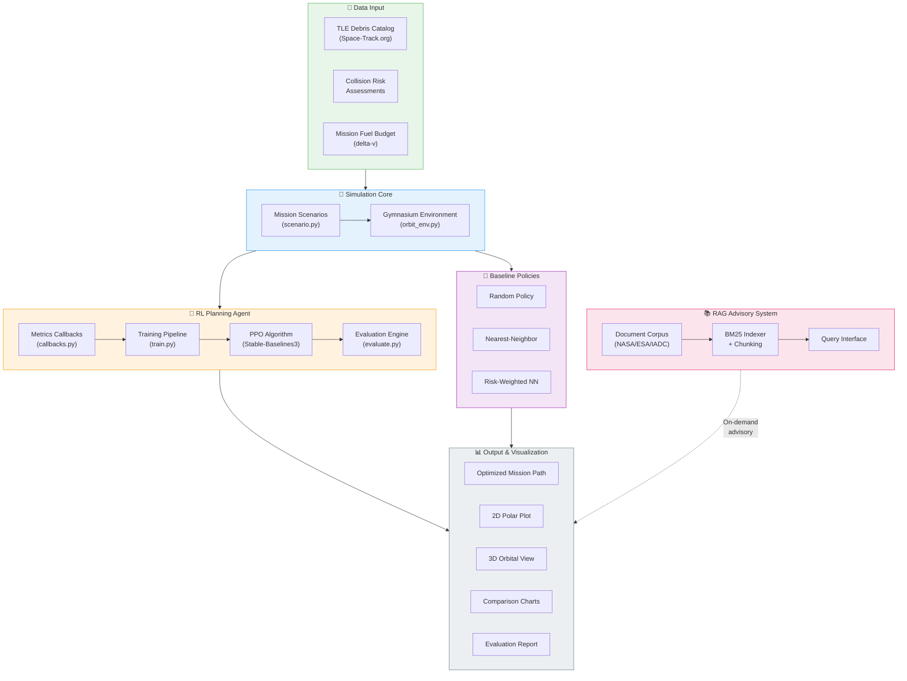
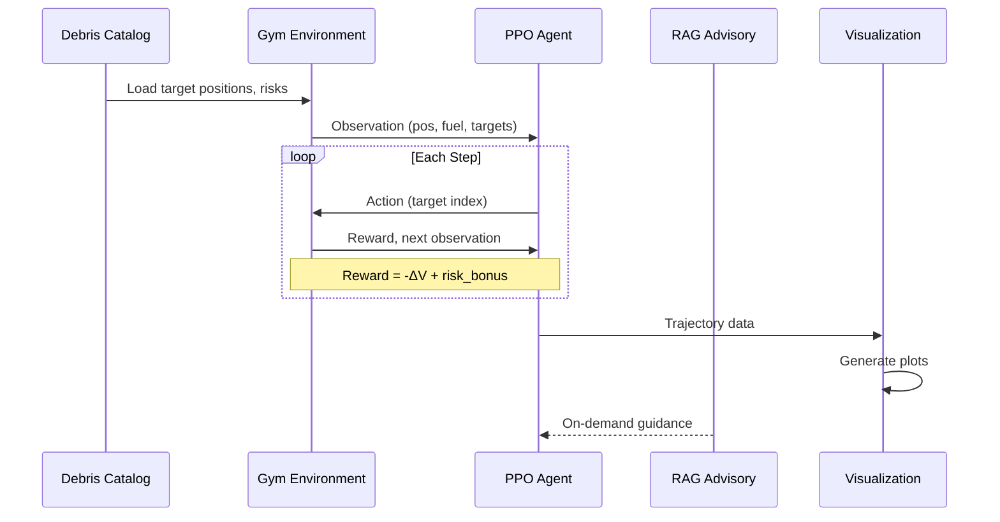

# System Architecture — Intelligent Orbital Debris Removal Planner

## High-Level Architecture

## Data Flow Sequence

## Component Details

| Component | File | Responsibility |
|---|---|---|
| **Environment** | `simulation/orbit_env.py` | State management, physics, reward computation |
| **Scenarios** | `simulation/scenario.py` | Target generation, mission constraints |
| **PPO Training** | `simulation/train.py` | Model training with callbacks and checkpoints |
| **Evaluation** | `simulation/evaluate.py` | Multi-policy comparison with statistics |
| **Baselines** | `simulation/policies.py` | Random, nearest-neighbor, risk-weighted policies |
| **Visualization** | `simulation/visualize.py` | 2D polar, 3D orbit, interactive Plotly HTML |
| **Charts** | `simulation/plot_results.py` | Delta-V comparison, distributions, reward curves |
| **RAG System** | `rag/rag_system.py` | BM25 document retrieval with structured responses |
| **Knowledge Base** | `docs/*.md, *.txt` | NASA/ESA/IADC reference documents |
