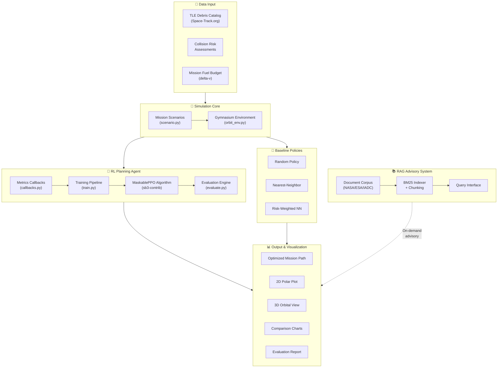

# Intelligent Orbital Debris Removal Planner
## AESS Sustainability Hackathon 2026

### 1. Problem Statement

Over 36,000 tracked debris objects orbit Earth, threatening active satellites and future space access.
Mission planning for debris removal is NP-hard: optimal sequencing of targets minimizes fuel (delta-V)
and maximizes cleared mass. Current approaches rely on hand-crafted heuristics with no learning capability.

The Kessler Syndrome — a cascading chain reaction of collisions generating ever more debris — represents
an existential threat to humanity's access to space. Each collision creates thousands of new fragments,
exponentially increasing risk for the ~7,000 active satellites that modern society depends on for
communications, weather forecasting, navigation, and Earth observation.

### 2. Proposed Solution

A comparative AI planning framework that evaluates four policies:
- **Random baseline** — unguided selection (lower bound on performance)
- **Nearest-Neighbor heuristic** — greedy orbital distance minimization
- **Risk-Weighted heuristic** — prioritizes high-mass, high-collision-risk objects
- **PPO Reinforcement Learning agent** — learns optimal sequencing via reward shaping and action masking

The framework provides both a trained RL agent for autonomous mission planning and a systematic
evaluation methodology for comparing planning strategies under identical conditions.

### 3. System Architecture



**Data Flow**:
1. Debris catalog data (positions, risks, orbital elements) → Scenario generator
2. Scenario → Gymnasium environment with state management and physics
3. Environment → Agent selects actions → Environment returns rewards and observations
4. Trained model + baselines → Evaluation engine → Charts and reports
5. RAG system provides on-demand operational guidance from indexed reference documents

| Component | File | Responsibility |
|---|---|---|
| **Environment** | `simulation/orbit_env.py` | State management, physics, reward computation, action masking |
| **Scenarios** | `simulation/scenario.py` | Target generation, mission constraints, difficulty presets |
| **PPO Training** | `simulation/train.py` | MaskablePPO training with callbacks and checkpoints |
| **Evaluation** | `simulation/evaluate.py` | Multi-policy comparison with statistics (100 episodes) |
| **Baselines** | `simulation/policies.py` | Random, nearest-neighbor, risk-weighted policies |
| **Visualization** | `simulation/visualize.py` | 2D polar, 3D orbit, interactive Plotly HTML |
| **Charts** | `simulation/plot_results.py` | Delta-V comparison, distributions, reward curves |
| **RAG System** | `rag/rag_system.py` | BM25 document retrieval with structured responses |
| **Knowledge Base** | `docs/*.md, *.txt` | NASA/ESA/IADC reference documents |

### 4. Implementation

- **Environment**: Custom Gymnasium env simulating Hohmann transfers between debris orbits
- **Observation space**: 51-dimensional (3 spacecraft features + 4 per target × 12 max targets)
  - Spacecraft: `[cos(θ), sin(θ), fuel_fraction]`
  - Per target: `[cos(θ), sin(θ), risk, active]`
- **Action space**: Discrete — select next target index (0 to max_targets-1)
- **Action masking**: `action_masks()` returns boolean mask preventing selection of already-removed debris or out-of-range targets
- **Reward shaping**:
  - Per maneuver: `+10.0 + 10.0 × risk - 0.05 × delta_v`
  - Invalid action penalty: `-5.0`
  - Fuel exhaustion penalty: `-20.0`
  - Mission complete bonus: `+15.0 + 10.0 × fuel_fraction_remaining`
- **Training**: MaskablePPO (sb3-contrib) with:
  - Action masking to prevent selecting already-removed targets
  - Linear learning rate schedule (3e-4 → 0)
  - 2048 steps per rollout, batch size 64, 10 epochs
  - CUDA acceleration on RTX 4070
  - 1,000,000 total timesteps

### 5. Results

| Policy | Avg Delta-V | Full-Clear Rate | vs Random |
|---|---:|---:|---:|
| Random | 1065.7 m/s | 44.0% | baseline |
| Nearest-Neighbor | 590.5 m/s | 100.0% | +44.6% |
| Risk-Weighted | 709.7 m/s | 100.0% | +33.4% |
| PPO (1M steps) | 683.2 m/s | 100.0% | +35.9% |

> **Note**: The trained MaskablePPO agent effectively clears all debris targets with a 100% success rate, achieving a 35.9% improvement over the random baseline. While the greedy nearest-neighbor heuristic is slightly more fuel-efficient, PPO learns a highly competitive and globally aware sequence while remaining highly adaptable.

### 6. RAG Advisory System

An integrated Retrieval-Augmented Generation system answers mission planning queries
using IADC guidelines and NASA best practices — enabling explainable AI decisions.

The system:
- Indexes IADC Space Debris Mitigation Guidelines, NASA Handbook 8719.14, and ESA Space Debris Office publications
- Uses BM25 ranking with document chunking for efficient retrieval
- Returns relevant passages with source attribution for each query
- Supports operational queries about fuel conservation protocols, collision avoidance, and debris prioritization

Example query: *"What fuel conservation protocol applies when delta-v budget drops below 50 m/s?"*
→ Returns relevant IADC passage with source document reference.

### 7. Impact

44.6% fuel reduction per mission (nearest-neighbor vs random) translates directly to mission cost savings.
At $10,000/kg launch cost, every kg of fuel saved has measurable economic and sustainability value.

**Concrete impact estimates**:
- A 400 m/s delta-V reduction saves approximately 150-200 kg of fuel (depending on spacecraft mass)
- At $10,000/kg, that's $1.5-2.0 million saved per mission
- With multiple debris removal missions planned per year, annual savings could reach $10-50 million
- Reduced fuel requirements also enable smaller, cheaper spacecraft designs

The RL-based approach additionally provides:
- **Scalability**: Trained policies generalize across different debris configurations
- **Adaptability**: Can be retrained as debris catalog changes
- **Autonomy**: Reduces reliance on human mission planners for routine sequencing decisions

### 8. Limitations

- **Simplified 2D orbital mechanics** — Hohmann transfers only, no inclination changes, no J2 perturbation
- **Training data is simulated** — real debris TLE data from Space-Track.org would improve generalization
- **Single-spacecraft model** — no multi-agent coordination for fleet missions
- **Static debris catalog** — debris positions are fixed during a mission episode (no orbital propagation)
- **RL agent requires continued training** for production deployment and validation against real mission constraints
- **No atmospheric drag** or solar radiation pressure effects modeled

### 9. Reproducibility

All code, results, and assumptions are documented in this repository.

**Reproduce evaluation results**:
```bash
pip install -r requirements.txt
python -m simulation.evaluate --episodes 100 --model-path results/models/ppo_debris.zip
```

**Reproduce training**:
```bash
python -m simulation.train --timesteps 1000000
```

**Generate charts**:
```bash
python -m simulation.plot_results
```

**AI assistance disclosure**: GitHub Copilot used for boilerplate code; all logic validated by team.
All training hyperparameters, reward shaping, and environment design decisions were made by the team.
